# 📝 Spendless

> > A **secure, offline-first personal finance app** with PIN & biometric authentication, encrypted
> > storage, and advanced transaction management. 
> Built with **Jetpack Compose, Room, DataStore, Hilt, Coroutines, Navigation, PDF/CSV export,
Biometric Authentication and Firebase Analytics/Crashlytics.**.

---

## Features

- 🔐 **Authentication** – Login, registration, 5-digit PIN.
- 🔒 **Encrypted Data Storage** – All PINs are encrypted before being stored locally.
- 💰 **Finance Tracking** – Record income & expenses, categorize transactions, and view largest
  transaction and previous week spending(expenses only).
- 📊 **Dashboard & Transactions** – Shows **recent transactions for the last 2 dates**, account
  balance, largest transaction, show all navigation, and create new transactions via FAB.
- 🗂 **All Transactions** – Lists all transactions with headers date, and export options (PDF/CSV).
- 📤 **Export Data** – Export transactions as **PDF or CSV** for dates such as current, last, last three, all, or
  custom ranges.
- ⚙️ **Settings** – Update preferences, session duration, lockout duration, and biometric settings.
- 🖥 **Secure UX** – PIN prompt on session expiry, lock screen after 3 failed attempts, seamless
  navigation and session handling.

---

## 🛠 Tech Stack

- **Kotlin** – Modern Android development.
- **Jetpack Compose** – Declarative UI.
- **Room Database** – Local persistence.
- **Hilt (DI)** – Dependency injection.
- **Coroutines + Flow** – Async programming and reactive streams.
- **DataStore(with custom encryption)** – Secure storage of authentication/session data using AES
  with Android Keystore..
- **Firebase** – Crashlytics and Analytics.
- **Export data** – Export data as PDF or CSV.

---

## 📲 Screenshots

<div style="text-align: center;">
  <figure>
    <p>Splash Screen</p>
    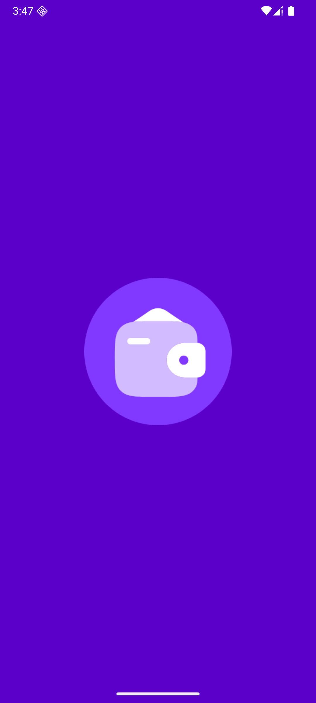
  </figure>
  <figure>
    <p>LogIn Screen</p>
    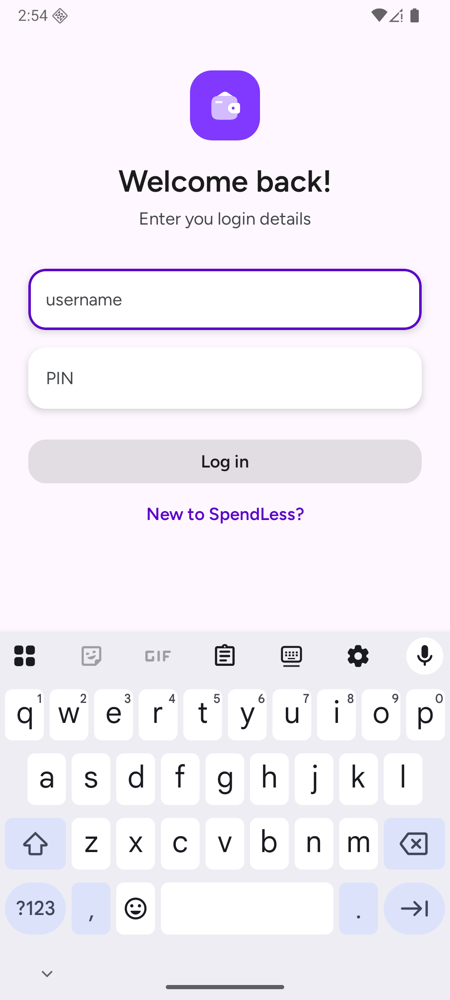
  </figure>
  <figure>
    <p>Register Screen</p>
    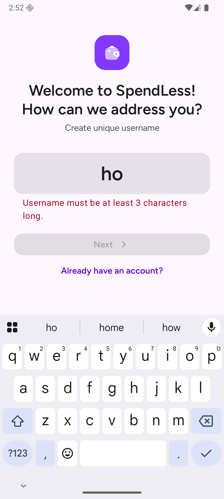
  </figure>
  <figure>
    <p>CreatePin Screen</p>
    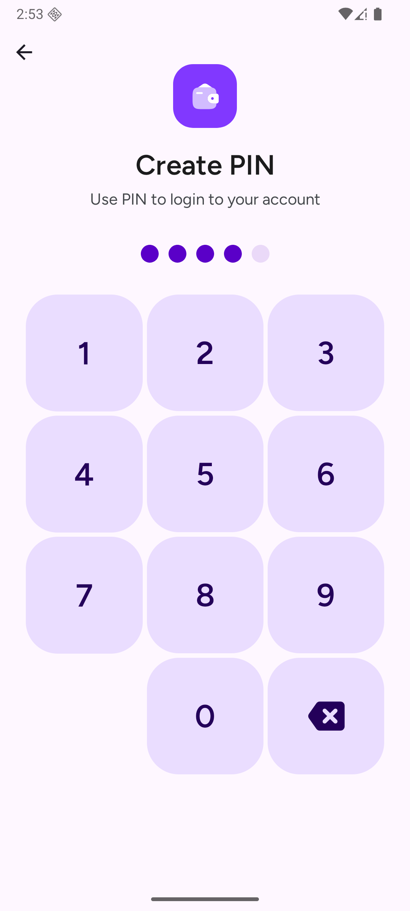
  </figure>
  <figure>
    <p>RepeatPin Screen</p>
    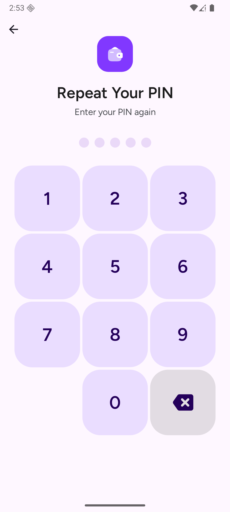
  </figure>
  <figure>
    <p>OnBoardingPreferences Screen</p>
    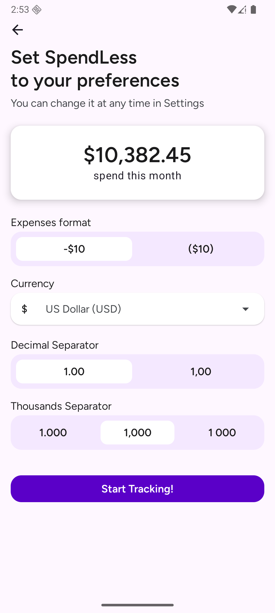
  </figure>
  <figure>
    <p>Dashboard Screen</p>
    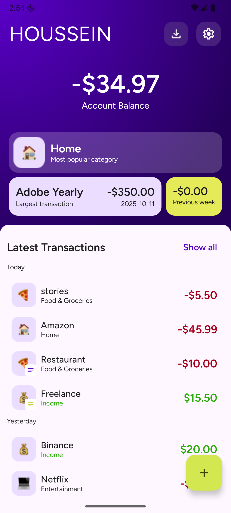
  </figure>
  <figure>
    <p>AllTransactions Screen</p>
    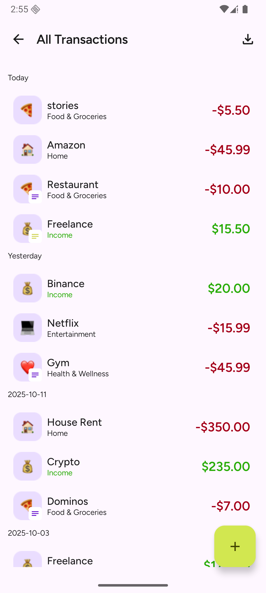
  </figure>
  <figure>
    <p>CreateTransaction Screen</p>
    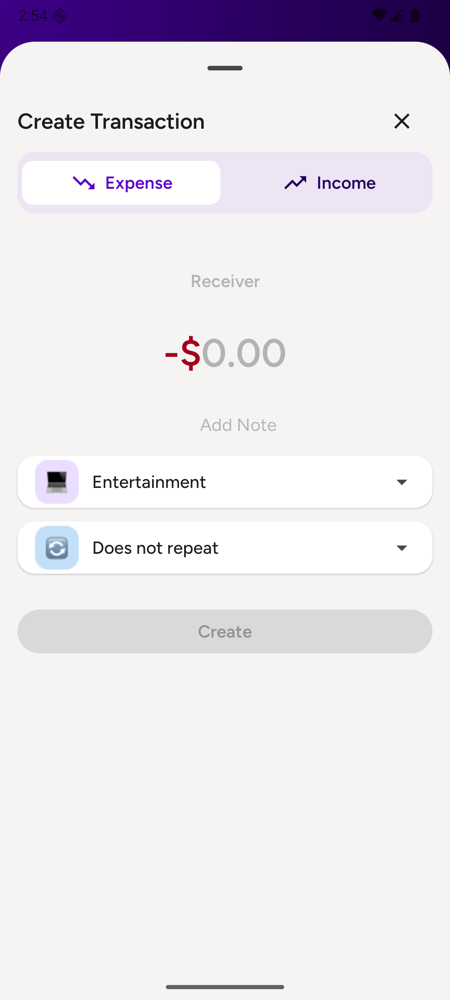
  </figure>
  <figure>
    <p>Settings Screen</p>
    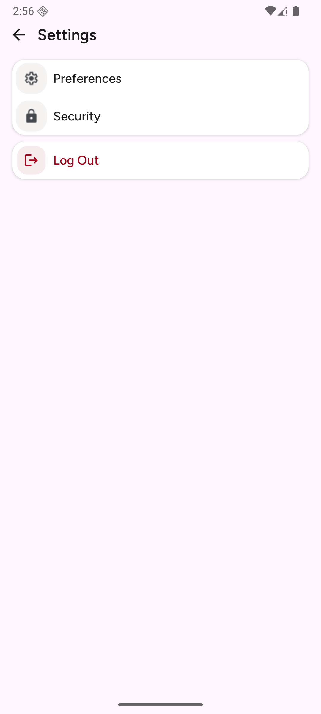
  </figure>  <figure>
    <p>Security Screen</p>
    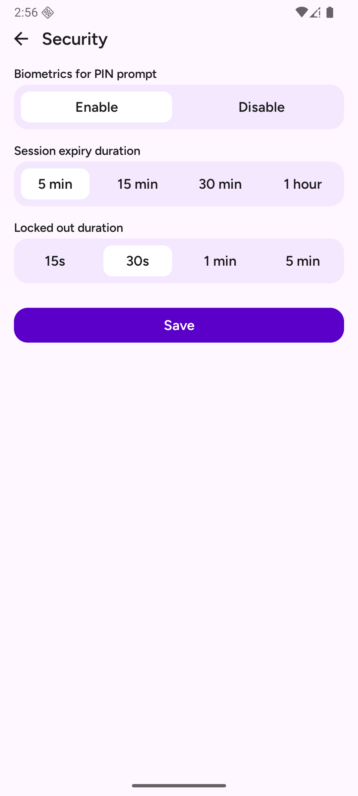
  </figure>  <figure>
    <p>PromptPin Screen</p>
    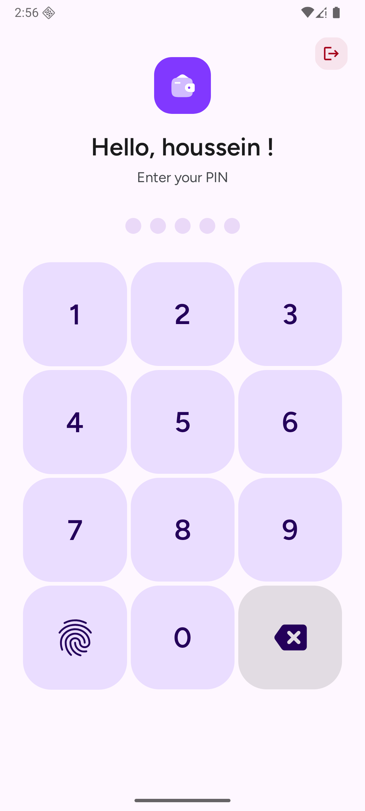
  </figure>
  <figure>
    <p>ExportData Screen</p>
    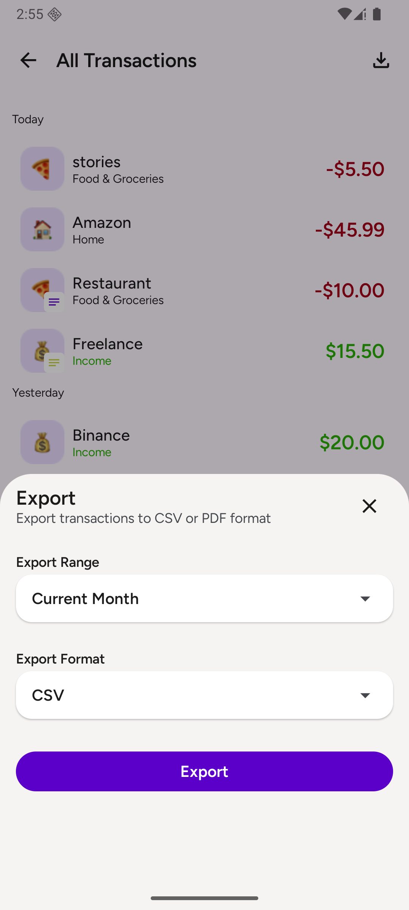
</figure>
  <figure>
    <p>Exported data in download file</p>
    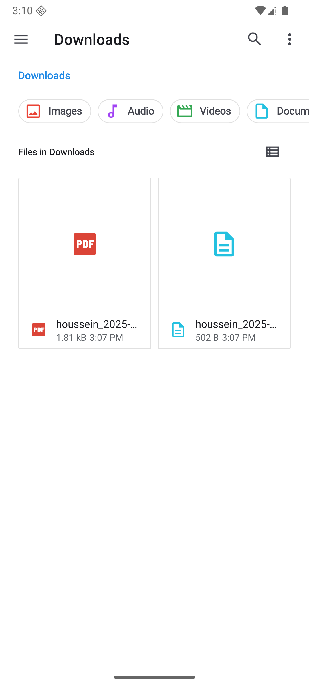
  </figure> 
<figure>
    <p>Exported data as PDF</p>
    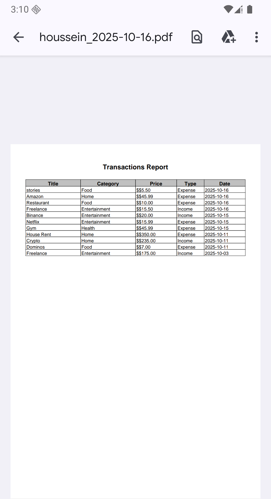
  </figure>

</div>

---

## 🚀 How It Works

1. 🔐**User logs in or registers** → PIN is validated.
2. 💰**User creates a transaction** → Transactions are saved locally.
3. 📊**Dashboard & All Transactions:**
- **Dashboard:** Shows account balance, largest transaction, weekly spending, and last 2 dates of transactions.
- **All Transactions:** Shows full transaction history with sticky headers.
4. ⚙️**Settings:** Users can update transaction formatting preferences (currency, separators) and security options (biometric enable/disable, session duration, lockout duration), or logout.
5. 🔑**Session & Security:**
- PIN prompt appears on session expiry or sensitive actions or when the app returns to the foreground.
- After 3 failed PIN/biometric attempts, the screen locks for the configured duration.
6. 📤**Export Data:** Users can export transactions as **PDF or CSV** for current, last, last three, all, or custom months.
7. 📶**Offline-First:** Transactions are always accessible offline; updates sync securely when possible.

---

## 📦 Project Setup

Clone the repo:

```bash
git clone https://github.com/Housseinch17/SpendlessExtended
cd SpendlessExtended
```